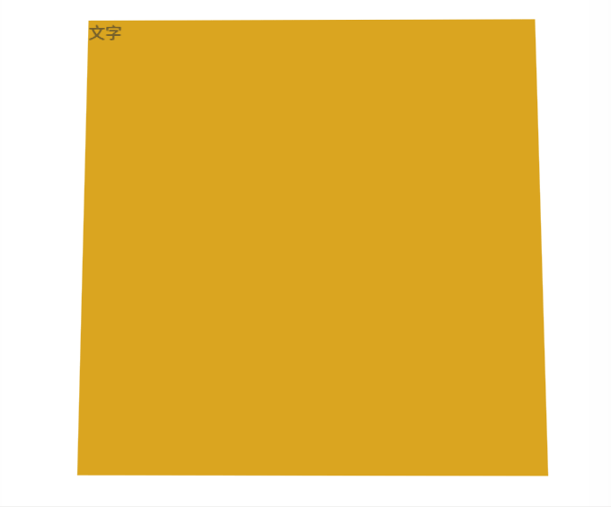

# Example



# How to use

```html
<template>
  <Simulate3D>
    <div class="dv">文字</div>
  </Simulate3D>
</template>

<script>
  import Simulate3D from "simulate3d/src/Simulate3D.vue";
  export default {
    components: {
      Simulate3D,
    },
  };
</script>

<style>
  .dv {
    width: 400px;
    height: 400px;
    background-color: goldenrod;
  }
</style>
```
